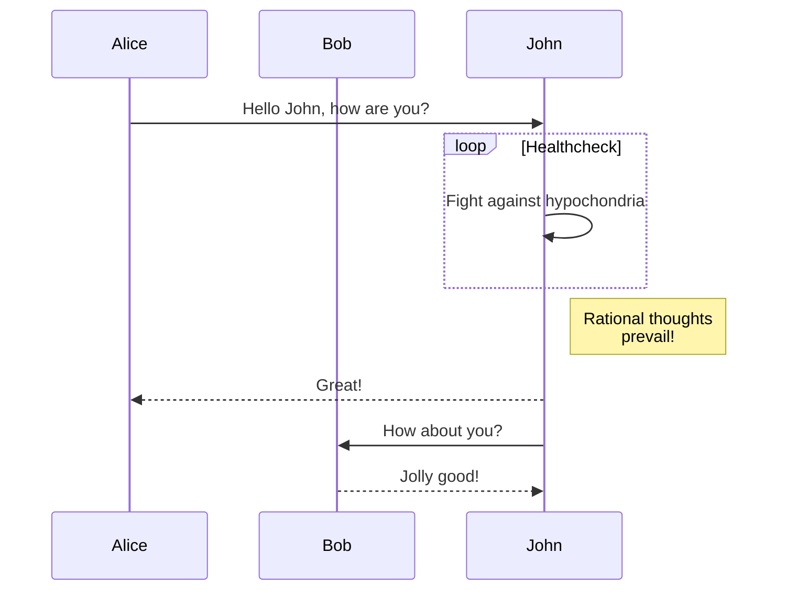

# HackMD Markdown Playground

###### tags: `playground`

## Markdown backtick inside codeblock

~~~

~~~

<i class="fa fa-pencil btn btn-default"></i>

<iframe border=0 frameborder=0 height=250 width=550
 src="https://twitframe.com/show?url=https%3A%2F%2Ftwitter.com%2Fjack%2Fstatus%2F20"></iframe>
 
  
 # asdfasdf



# long document test haha

:::spoiler <b>asdfasdf</b>

:::

## Figcaption

<figure>
  
  <figcaption>Fig.1 - Trulli, Puglia, Italy. </figcaption>
</figure>

